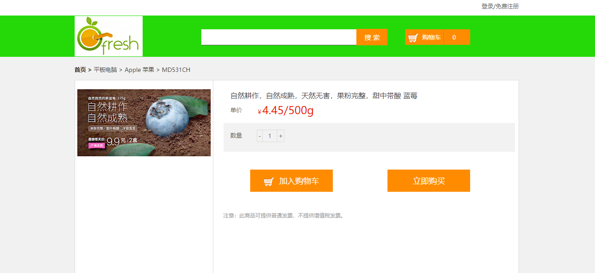
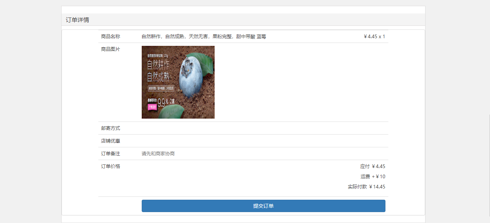
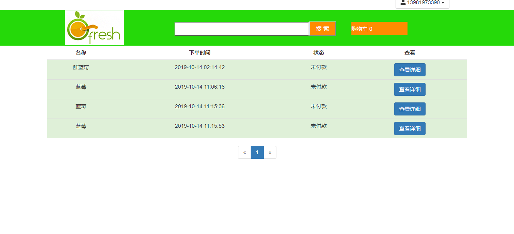

# 水果网在线商城

1. 后端技术架构
    * springboot2.0.5.RELEASE
    * dubbo2.6.2
    * Mysql5.7
    * mybatis3.5.2
    * tkmapper
    * rocketmq4.3.0
    * Zookeeper
    * Elasticsearch（未开发）
    * Kafka（未开发，做日志系统）
    * redis
    * druid
    * Sentinel （未开发）
2. 前端技术架构html+js（注明：界面样式多是仿写[freshFruit](https://github.com/hajnalmin/freshFriut)，个别前端页面放别人所写，见谅）
3. 水果在线商城是基于springboot+dubbo构建的分布式在线商城系统
4. 采用redis做缓存和分布式session
5. 对热门商品，采用rocketmq发送消息创建订单
6. Sentinel对不重要接口限流，减轻服务器负担
7. 调用支付宝接口采用沙箱环境支付

## 项目演示地址

* 水果商城系统演示地址：http://49.235.118.239（暂时停止，审核）
* 后续打算开发促销秒杀活动模块..
* 商户系统:后期正在开发..
* 后台管理系统：后期正在开发..


# 水果在线系统模块
* sql  数据库脚本             
* fmall-parent 父项目                                
* fmall-commons 公共的组件
* fmall-tools redis公共连接
* famll-member  用户系统                          
* fmall-order 水果在线商城订单系统   
* famll-open  商品/购物车/首页渲染等交互                   
* famll-shopping 商户系统，包括首页渲染，目前未完成，采用默认商户                                     
* fmall-stocks 库存系统      
* fmall-pay 支付模块  
* fmall-search 查找模块 （待开发）                                 
                                                   

# 效果图










# 项目启动
本项目启动需要自行安装zookeeper,redis,rocketmq。
[zookeeper安装教程](https://www.e-learn.cn/content/qita/2410440)
[redis安装教程](https://www.runoob.com/redis/redis-install.html)
[rocketmq安装教程](http://rocketmq.apache.org/docs/quick-start/)
* 修改配置文件application-dev.yml中连接配置（注redis的在common-tools中,并且redis的密码根据自己启动设置修改）
* 启动好mysql,redis,rocketmq,zookeeper
* 启动各个项目，无顺序依赖（暴露外界接口在fmall-open中）


- 本人属于小菜，很多不足的地方，本项目纯粹为学习开发，后续将继续完善以及注解编写，欢迎各位小伙伴通过Pull Request提交问题修复

！注意：UnlimitedJCEPolicyJDK8里的jar包需要替换jre\lib\security下的jar包（我是jdk8，根据需要网上可以找到对应的jar），这样才不会在加密时报错。









